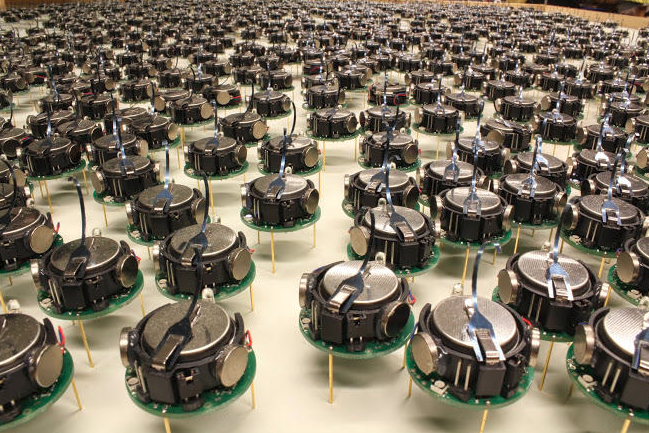
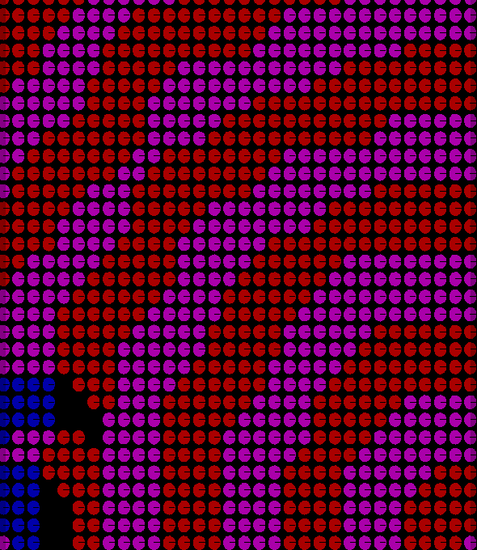
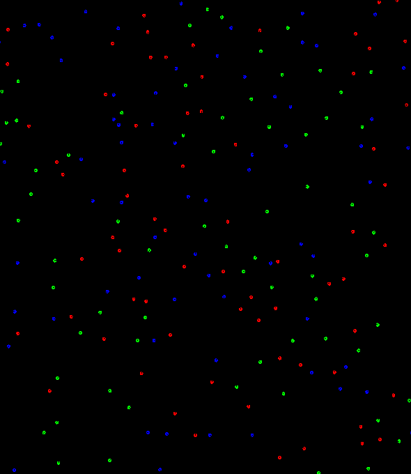
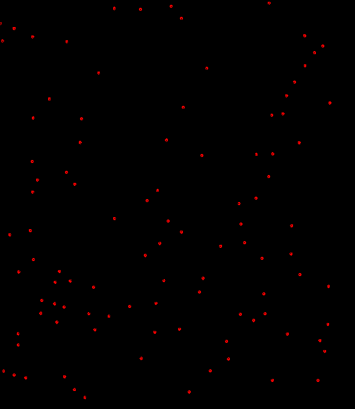

# Swarm Robotics

This repo demonstrates the implementation results of three multi-agent algorithms, pertaining to the coordination, segregation, and locomotion of a robot swarm respectively. I implement the algorithms on kilobots and simulate their behaviors. [Kilobot](https://www.kilobotics.com/) is a low cost swarm robot designed by professor Michael Rubenstein. More details can be found [here](https://dash.harvard.edu/bitstream/handle/1/9367001/rubenstein_kilobotlow.pdf?sequence=1).

### Coordinate system based on Hopcount

In a multi-agent distributed system, it is necessary for robots to communicate their relative position before delivering coordinated behaviors. Hopcount, an approximate representation of how far one robot is from another, is used to triangulate the relative position of a robot within a swarm. In the simulation below, a swarm of static kilobots will first communicate with each other, marked by color changes, before forming the letter "N" of "Northwestern" collectively. More details of the algorithm are presented in this [paper](http://citeseerx.ist.psu.edu/viewdoc/download?doi=10.1.1.7.8705&rep=rep1&type=pdf).

### Segregation based on Brazil nut effect

Often times it is helpful for a robot swarm to segregate into different functional groups. One distributed way of achieving segregation is through the Brazil nut effect: The largest particles in a bag of variously sized objects usually end up on the surface after shaking the bag. A typical example is a container of mixed nuts, and Brazil nuts which are the largest usually appear on top. In the simulation kilobots of different color have different virtual radii and thus will segregate into different groups through their interaction. More details regarding the algorithm can be found [here](http://naturalrobotics.group.shef.ac.uk/supp/2012-001/)

### Locomotion based on Reynolds flocking

[Starling flock](https://www.youtube.com/watch?v=V4f_1_r80RY) is one of the most spectacular swarm behaviors found in nature. When one starling changes direction or speed, its neighbors will respond to the change almost simultaneously and thus the change propagates throughout the flock lightning fast regardless of its size. As no single starling dictates the movement of the flock, interesting patterns can emerge from the collective behavior. This simulation tries to replicate this swarm behavior by implementing Reynolds flocking, which is characterized by three rules: keep separation to avoid crowding, maintain alignment with the average heading of local flockmates, and retain cohesion to move towards the center of local flockmates. The algorithm is detailed in this [paper](https://infoscience.epfl.ch/record/169280/files/IROS11_Hauert.pdf).

### Code

I decide not to put up my code here as these simulations are likely to be assigned as homework for the future swarm robotics class. If you have any questions about my implementations, you can find me at my [portfolio page](https://yanweiw.github.io/). Cover photo credit to [Harvard SEAS](https://www.seas.harvard.edu/news/2014/08/self-organizing-thousand-robot-swarm).
